# Architecture Diagrams

Comprehensive Mermaid diagrams covering every architectural aspect of DeerFlow.

---

## 1. High-Level Service Architecture

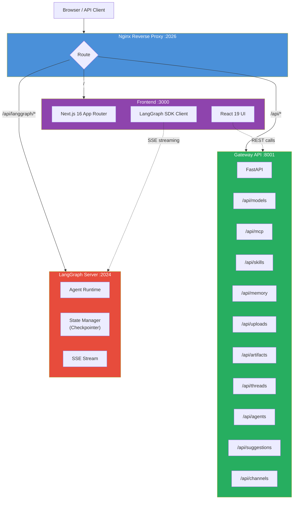

---

## 2. Complete Request Flow

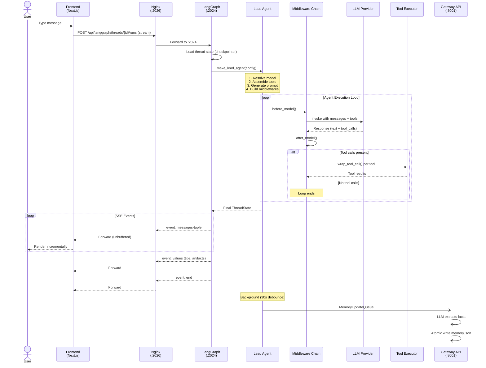

---

## 3. Lead Agent Creation Pipeline

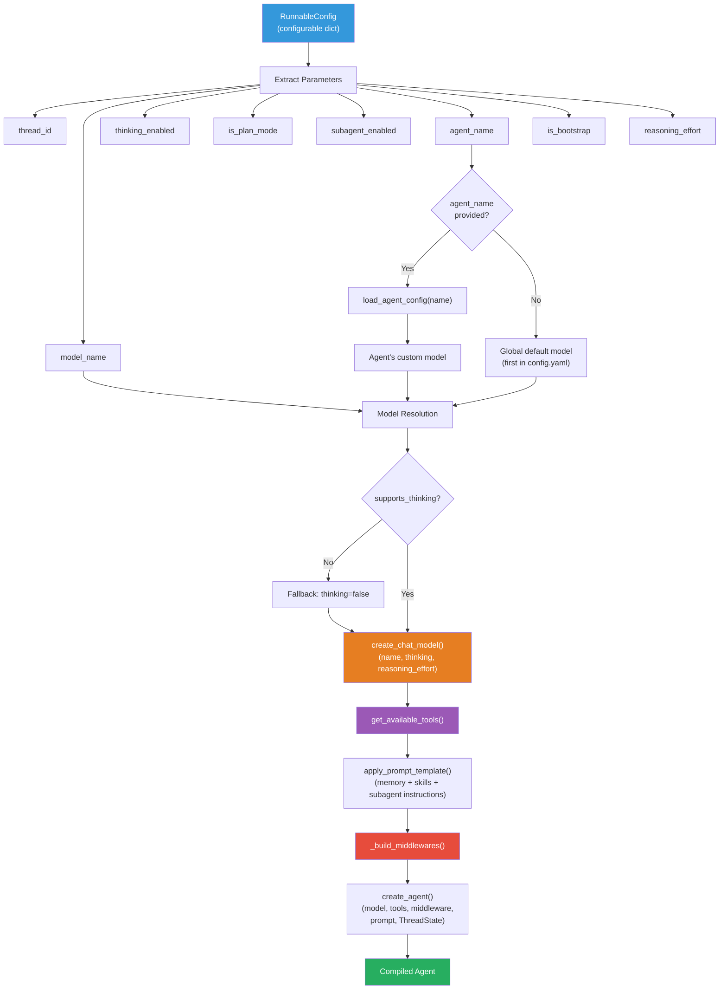

---

## 4. Middleware Chain

```mermaid
flowchart TD
    Request["Incoming Request"] --> M1

    subgraph ALWAYS["Always Active"]
        M1["1. ThreadDataMiddleware<br/>Creates per-thread dirs"]
        M2["2. UploadsMiddleware<br/>Injects file metadata"]
        M3["3. SandboxMiddleware<br/>Acquires sandbox"]
        M4["4. DanglingToolCallMiddleware<br/>Patches missing ToolMessages"]
    end

    subgraph CONDITIONAL["Conditionally Enabled"]
        M5["5. GuardrailMiddleware<br/>Pre-tool-call auth<br/><i>if guardrails.enabled</i>"]
        M6["6. ToolErrorHandlingMiddleware<br/>Exceptions → ToolMessages"]
        M7["7. SummarizationMiddleware<br/>Context reduction<br/><i>if summarization.enabled</i>"]
        M8["8. TodoListMiddleware<br/>Plan mode tasks<br/><i>if is_plan_mode</i>"]
        M9["9. TokenUsageMiddleware<br/>Usage tracking<br/><i>if token_usage.enabled</i>"]
    end

    subgraph POSTPROCESS["Post-Processing"]
        M10["10. TitleMiddleware<br/>Auto-generate title"]
        M11["11. MemoryMiddleware<br/>Queue for memory update"]
        M12["12. ViewImageMiddleware<br/>Base64 injection<br/><i>if supports_vision</i>"]
        M13["13. DeferredToolFilterMiddleware<br/>Hide deferred MCP tools<br/><i>if tool_search.enabled</i>"]
        M14["14. SubagentLimitMiddleware<br/>Truncate excess tasks<br/><i>if subagent_enabled</i>"]
        M15["15. LoopDetectionMiddleware<br/>Break repetitive loops"]
    end

    subgraph FINAL["Must Be Last"]
        M16["16. ClarificationMiddleware<br/>Intercepts ask_clarification<br/>→ Command(goto=END)"]
    end

    M1 --> M2 --> M3 --> M4
    M4 --> M5 --> M6 --> M7 --> M8 --> M9
    M9 --> M10 --> M11 --> M12 --> M13 --> M14 --> M15
    M15 --> M16

    M16 --> LLM["LLM Execution Loop"]

    style ALWAYS fill:#2ecc71,color:#fff
    style CONDITIONAL fill:#f39c12,color:#000
    style POSTPROCESS fill:#3498db,color:#fff
    style FINAL fill:#e74c3c,color:#fff
```

---

## 5. Tool Assembly Pipeline

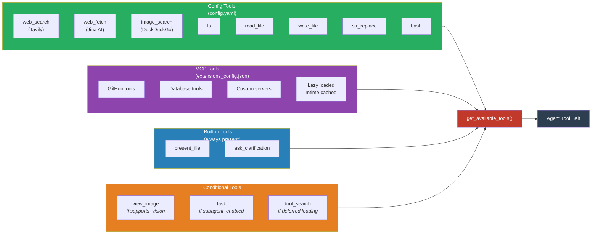

---

## 6. Memory System

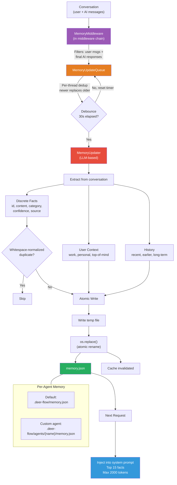

---

## 7. Subagent Execution Model

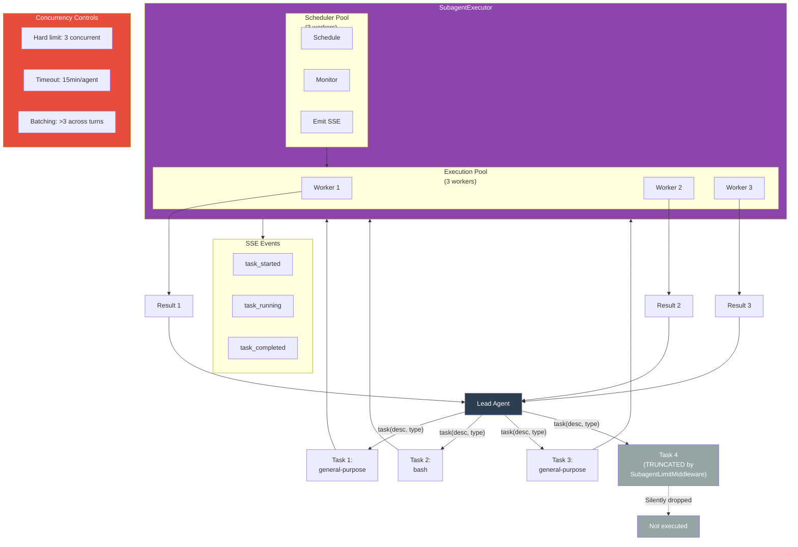

---

## 8. Sandbox & Virtual Path System

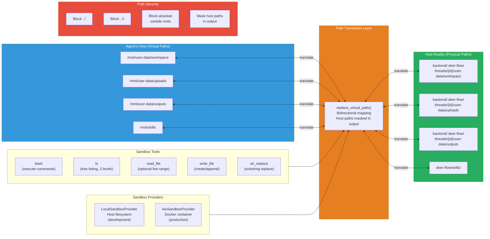

---

## 9. MCP Integration

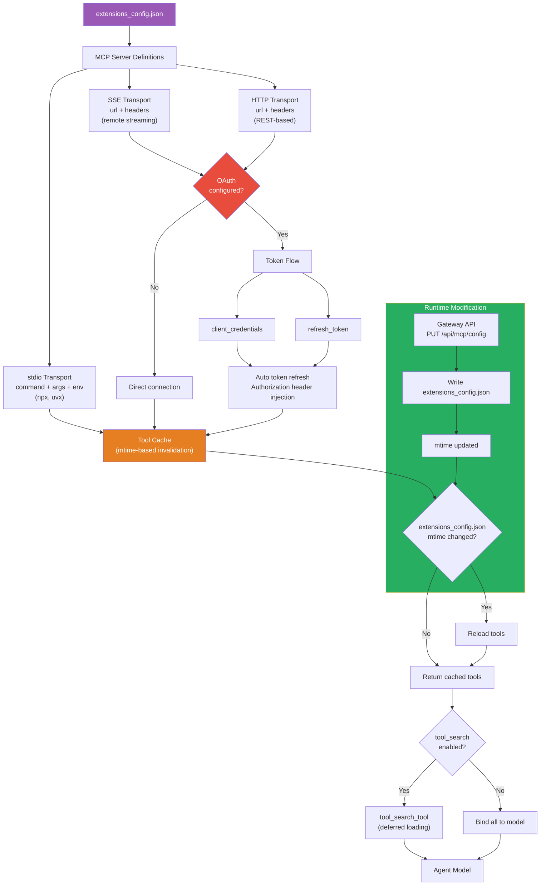

---

## 10. Configuration System

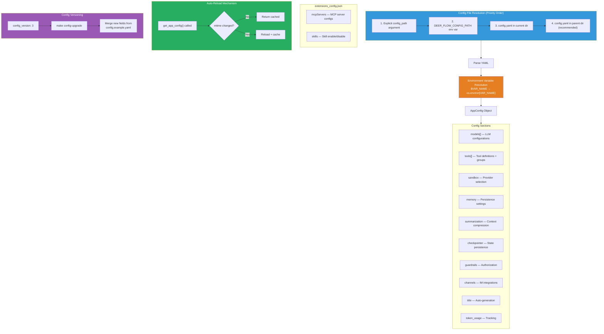

---

## 11. Harness / App Boundary

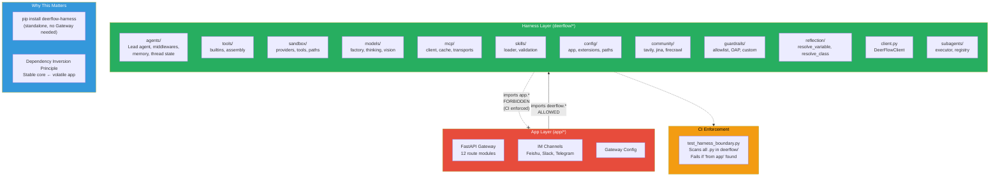

---

## 12. Skills Lifecycle

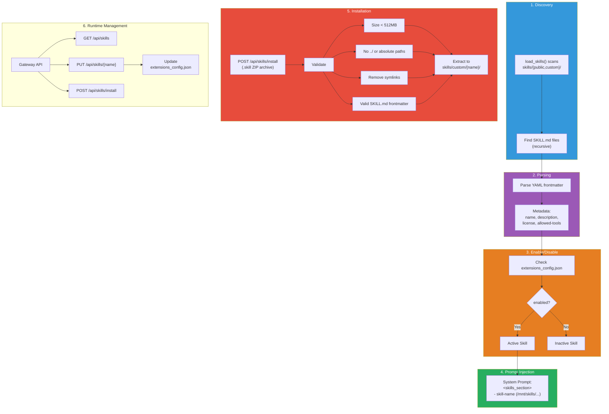

---

## 13. ThreadState Schema

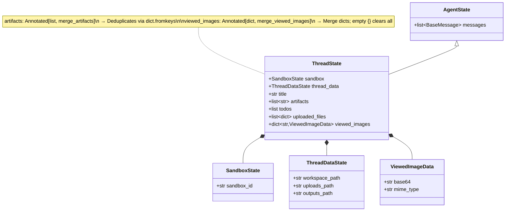

---

## 14. Package Management & Workspace Structure

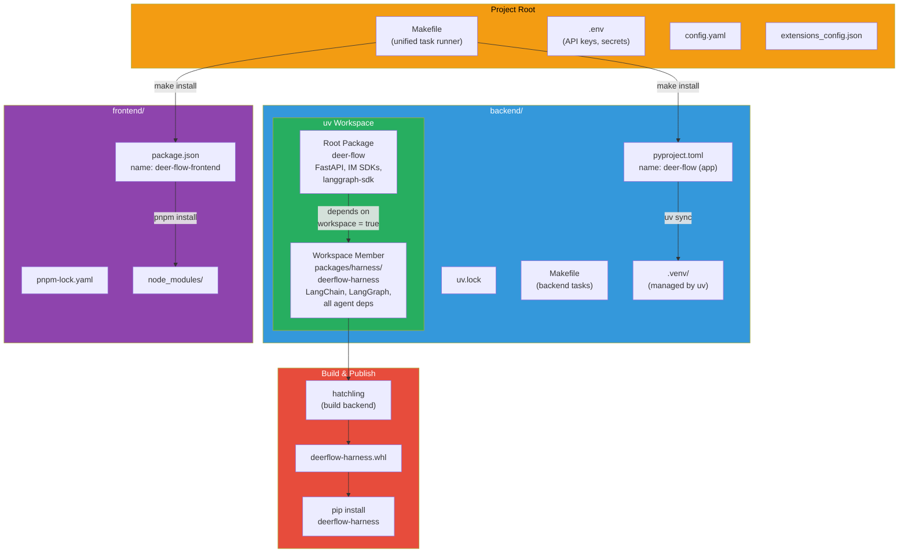

---

## 15. Deployment Options

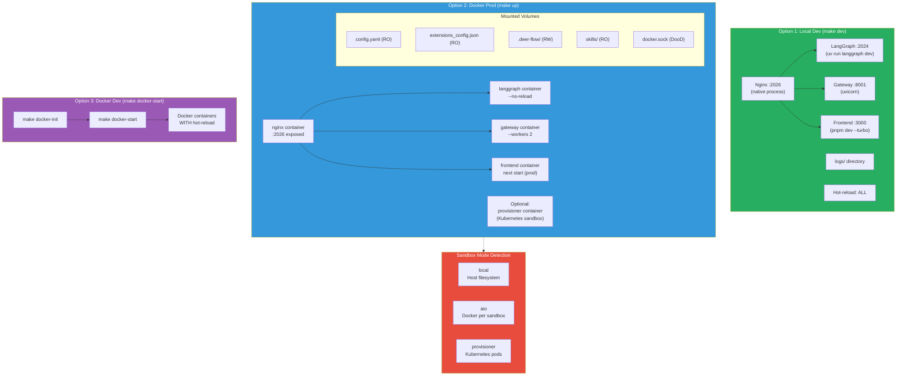

---

## 16. Security Layers

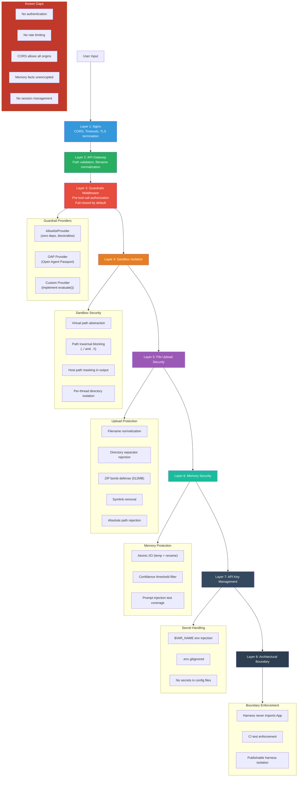

---

## 17. Frontend Architecture

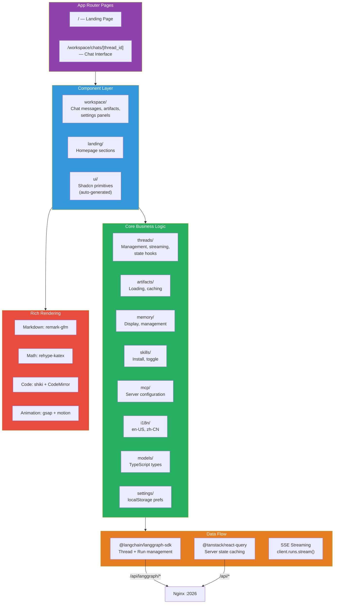

---

## 18. Checkpointer System

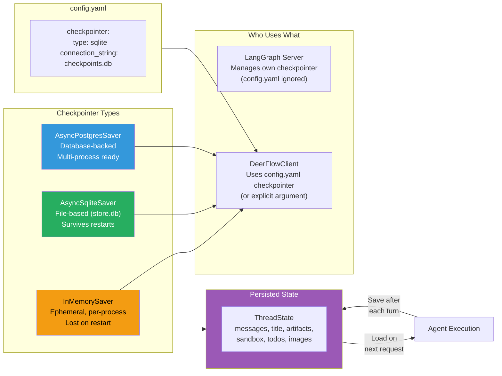

---

## 19. Development Lifecycle

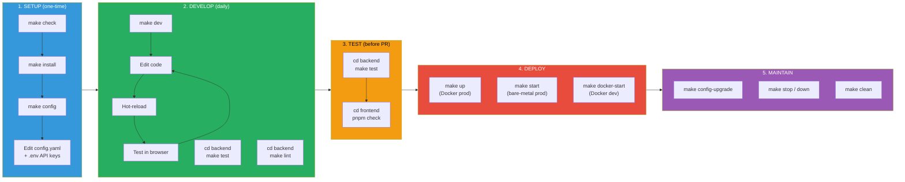

---

## How to Render These Diagrams

**VS Code**: Install the "Markdown Preview Mermaid Support" extension, then preview this file with `Cmd+Shift+V`.

**GitHub**: Mermaid diagrams render natively in GitHub Markdown — just push this file.

**CLI**: Use `mmdc` (Mermaid CLI) to export as PNG/SVG:
```bash
npm install -g @mermaid-js/mermaid-cli
mmdc -i 10_architecture_diagrams.md -o diagrams/ -e png
```
