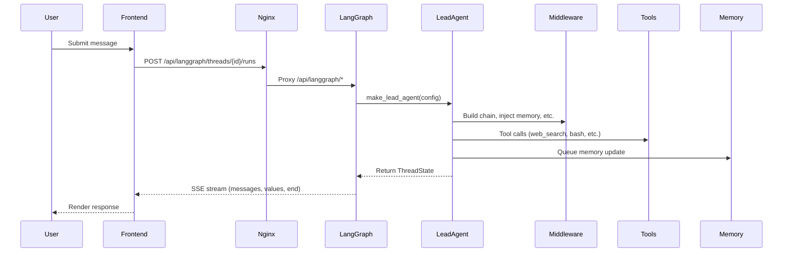
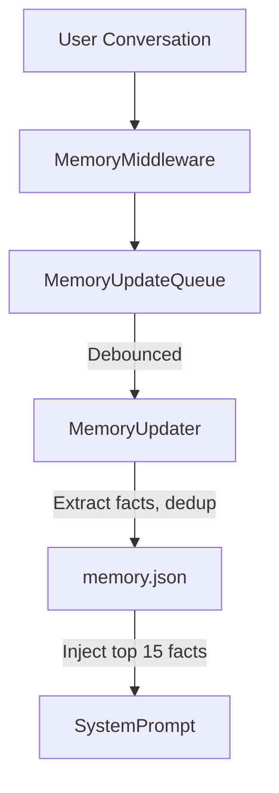
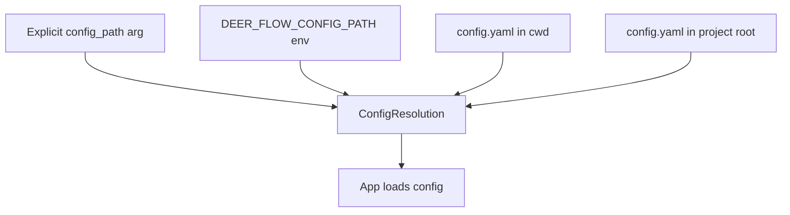
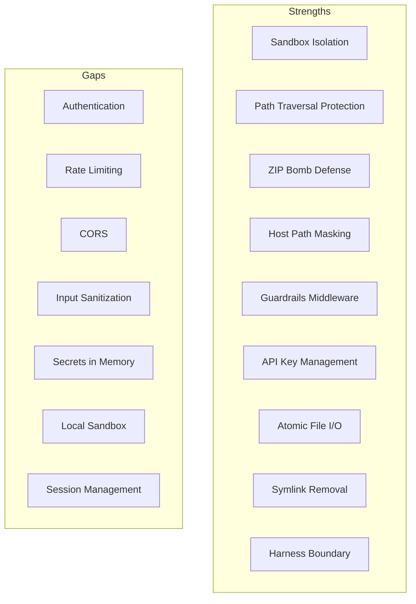
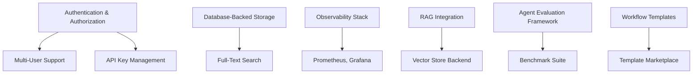

# DeerFlow Architecture: Comprehensive Mermaid Diagrams

This document visualizes the DeerFlow architecture, subsystems, and key patterns using rich Mermaid diagrams, synthesizing insights from the full repo analysis.

---

## 1. High-Level System Architecture

```mermaid
graph TD
    Browser["Browser / API Client"] --> Nginx[Nginx (port 2026)\nUnified Entry Point]
    Nginx --> LangGraph[LangGraph Server\nPort 2024\nAgent runtime, State mgmt, Thread handling, Tool execution]
    Nginx --> Gateway[Gateway API\nPort 8001\nFastAPI REST, Models, MCP, Skills, Memory, Uploads]
    Nginx --> Frontend[Frontend\nPort 3000\nNext.js 16, React 19, Chat workspace, Landing page]
```

---

## 2. Lead Agent Creation Flow

```mermaid
flowchart TD
    A[make_lead_agent(config: RunnableConfig)] --> B[Extract runtime config]
    B --> C[Model Resolution\n(create_chat_model)]
    C --> D[Tools Assembly\n(get_available_tools)]
    D --> E[System Prompt\n(apply_prompt_template)]
    E --> F[Middleware Chain\n(_build_middlewares)]
    F --> G[create_agent(...)]
```

---

## 3. Middleware Chain (Aspect-Oriented)

```mermaid
flowchart TD
    subgraph Middleware Execution Order
        A1[ThreadDataMiddleware] --> A2[UploadsMiddleware] --> A3[SandboxMiddleware] --> A4[DanglingToolCallMiddleware]
        A4 --> A5[GuardrailMiddleware] --> A6[ToolErrorHandlingMiddleware] --> A7[SummarizationMiddleware]
        A7 --> A8[TodoListMiddleware] --> A9[TokenUsageMiddleware] --> A10[TitleMiddleware]
        A10 --> A11[MemoryMiddleware] --> A12[ViewImageMiddleware] --> A13[DeferredToolFilterMiddleware]
        A13 --> A14[SubagentLimitMiddleware] --> A15[LoopDetectionMiddleware] --> A16[ClarificationMiddleware]
    end
```



---

## 4. Agent Request/Execution Flow



---

## 5. Memory System Architecture



---

## 6. Tool Assembly Pipeline

```mermaid
flowchart TD
    get_available_tools --> ConfigTools[Config-Defined Tools]
    get_available_tools --> MCPTools[MCP Tools]
    get_available_tools --> Builtins[Built-in Tools]
    get_available_tools --> Vision[Vision Tool (if supported)]
    get_available_tools --> Subagent[Subagent Tool (if enabled)]
    get_available_tools --> ToolSearch[Tool Search (deferred loading)]
```

---

## 7. Subagent System

```mermaid
flowchart TD
    LeadAgent -->|task| SubagentExecutor
    SubagentExecutor --> SchedulerPool[Scheduler Pool (3 workers)]
    SubagentExecutor --> ExecutionPool[Execution Pool (3 workers)]
    ExecutionPool --> SSE[Emit SSE Events: task_started, task_running, task_completed]
```

---

## 8. Sandbox Virtual Path Abstraction

```mermaid
flowchart TD
    AgentPerspective[Agent: /mnt/user-data/workspace] --> HostPath[Host: backend/.deer-flow/threads/{id}/user-data/workspace]
    AgentPerspective2[Agent: /mnt/skills] --> HostPath2[Host: deer-flow/skills/]
```

---

## 9. Configuration Layering



---

## 10. Security Posture Overview



---

## 11. Enhancement Opportunities (Sample)



---

*Generated by GitHub Copilot (GPT-4.1) from DeerFlow repo analysis, March 2026.*
